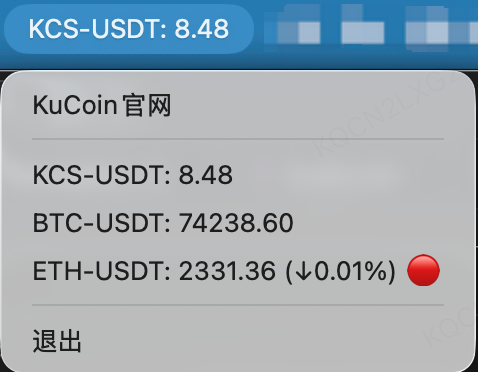

# CoinPriceBar

[中文](./README.md)

A lightweight **macOS menu bar app** for displaying **cryptocurrency prices** in real time.  
Built with **Python + rumps + py2app**.

The current version supports **KuCoin + Binance**, with a plugin-based source architecture and a UI-only `config.json`.



---

## ✨ Features

- ✅ Native macOS menu bar app (no Dock icon)
- ✅ Plugin-based exchange sources for easier future expansion
- ✅ Real-time WebSocket updates from **KuCoin** and **Binance**
- ✅ Configurable visible item count
- ✅ Configurable title item and display order
- ✅ Configurable display fields, title template, and menu template
- ✅ Apple Silicon & Intel builds
- ✅ One-line installer

---

### ✅ Permissions

The application:

- ❌ Does NOT require login
- ❌ Does NOT require administrator privileges
- ❌ Does NOT access local files
- ❌ Does NOT access contacts, photos, microphone, or camera
- ❌ Does NOT collect any personal data

It only performs the following actions:

- ✅ **Network access**: fetches public price data from exchange WebSocket APIs
- ✅ **Background execution**: runs as a menu bar app

---

## 📊 Supported Exchanges

| Exchange | Status |
|--------|--------|
| KuCoin | ✅ Supported |
| Binance | ✅ Supported |
| OKX | 🚧 Extensible |
| Bybit | 🚧 Extensible |

---

## ⚙️ Configuration

On first launch, the app creates `config.json` in the project root.

> `config.json` is now a **UI-only config** file.
> It controls how the menu bar app renders data, not which exchanges or trading pairs are monitored.
> Default monitored pairs are defined in `coinpricebar/config.py` under `DEFAULT_TICKERS`.

Example:

```json
{
  "ui": {
    "max_visible": 4,
    "title_index": 0,
    "display_fields": ["exchange", "symbol", "price", "change_percent", "status"],
    "title_template": "{exchange}:{symbol} {price}",
    "menu_template": "{exchange}:{symbol} {price} ({change_percent})",
    "show_exchange_links": true,
    "tickers": [
      { "key": "kucoin::KCS-USDT", "visible": true, "order": 0, "pinned_title": true },
      { "key": "kucoin::BTC-USDT", "visible": true, "order": 1, "pinned_title": false },
      { "key": "binance::BTC-USDT", "visible": false, "order": 3, "pinned_title": false }
    ]
  }
}
```

### UI config fields

- `max_visible`: maximum number of items shown
- `title_index`: which visible item is shown in the menu bar title, starting at `0`
- `display_fields`: fallback fields if a template is invalid; supports:
  - `exchange`
  - `symbol`
  - `price`
  - `change`
  - `change_percent`
  - `status`
- `title_template`: menu bar title template
- `menu_template`: dropdown item template
- `show_exchange_links`: whether to show exchange home links in the menu
- `tickers`: UI display preferences for each default monitored item, including visibility, order, and title pinning

The menu now supports **UI Config Editor**, **Open Config File**, and **Reload UI Config**.
Changes to `config.json` can be reloaded live and only affect UI rendering, not the subscribed data sources.

### UI behavior notes

- Items in `DEFAULT_TICKERS` stay subscribed and keep receiving updates
- `ui.tickers` only controls visibility, ordering, and which item is pinned to the title
- Hidden items still update in the background, so showing them again restores live values immediately

### Changing monitored pairs

Edit `DEFAULT_TICKERS` in `coinpricebar/config.py`:

- Order = display order
- First `max_visible` items = actual visible items
- Tuple format: `("exchange", "symbol", "display_name")`

### Project structure

- `KCSApp.py`: compatibility launcher
- `coinpricebar/main.py`: app startup entry
- `coinpricebar/app.py`: menu bar UI and monitor orchestration
- `coinpricebar/config.py`: UI config and default monitored pairs
- `coinpricebar/sources/`: exchange source plugins

---

## 📦 Install

### One-line installer (recommended)

```bash
bash -c "$(curl -fsSL https://github.com/LY1806620741/CoinPriceBar/releases/latest/download/install-macos.sh)"
```

### Run locally

```bash
python3 -m pip install -r requirements.txt
python3 KCSApp.py
```

### Build `.app`

```bash
python3 -m pip install -r requirements.txt
python3 setup.py py2app
```

---

## ⚠️ macOS Security Warning

On first launch, macOS may show the following message:

> **“Apple cannot verify that ‘CoinPriceBar’ is free from malware.”**

This is expected behavior for applications that are **not signed or notarized by Apple**.

### How to open the app

1. Open **System Settings → Privacy & Security**. If needed, run:
```bash
open "x-apple.systempreferences:com.apple.preference.security?Privacy"
```
2. Locate CoinPriceBar at the bottom
3. Click **Open Anyway**
4. Confirm once more

> This only needs to be done once.

---

## 📌 Security Notice

- This is an **open-source project**
- All source code is publicly available
- The app performs no actions beyond price display
- **This project does not provide financial advice**
